
- PaperMod-PE 集成: [Mermaid@10.9.0](https://cdn.jsdelivr.net/npm/mermaid@10.9.0/dist/mermaid.esm.min.mjs)，
如果使用其他版本可能存在图形样式不一致等问题。
- 本站 Mermaid diagrams 未适配 `dark` 主题，请切换使用 `light` 主题预览。 


## 流程图

> 文档参考：[Mermaid - Flowchart](https://mermaid.js.org/syntax/flowchart.html)

```markdown {lang=mermaid}
flowchart LR
A[Hard] -->|Text| B(Round)
B --> C{Decision}
C -->|One| D[Result 1]
C -->|Two| E[Result 2]
```


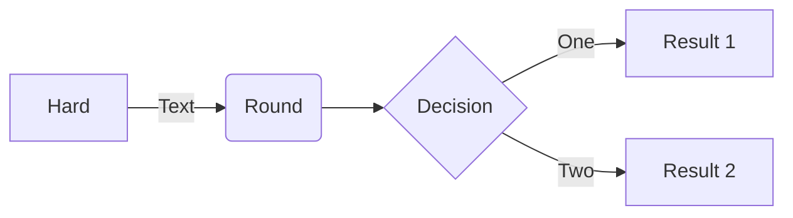

## 时序图

> 文档参考：[Mermaid - Sequence Diagram](https://mermaid.js.org/syntax/sequenceDiagram.html)

```markdown {lang=mermaid}
sequenceDiagram
Alice->>John: Hello John, how are you?
loop HealthCheck
    John->>John: Fight against hypochondria
end
Note right of John: Rational thoughts!
John-->>Alice: Great!
John->>Bob: How about you?
Bob-->>John: Jolly good!
```

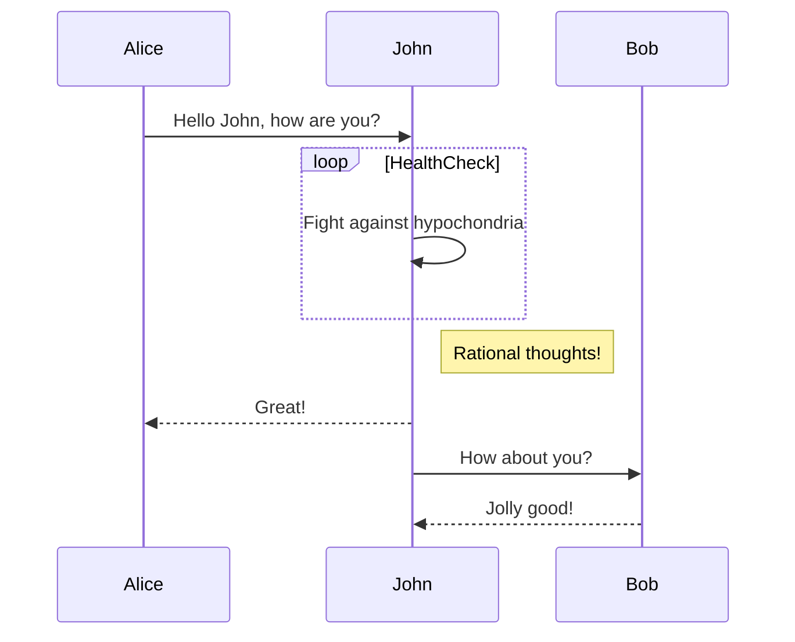

## 甘特图

> 文档参考：[Mermaid - Gantt](https://mermaid.js.org/syntax/gantt.html)

```markdown {lang=mermaid}
gantt
    section Section
    Completed :done,    des1, 2014-01-06,2014-01-08
    Active        :active,  des2, 2014-01-07, 3d
    Parallel 1   :         des3, after des1, 1d
    Parallel 2   :         des4, after des1, 1d
    Parallel 3   :         des5, after des3, 1d
    Parallel 4   :         des6, after des4, 1d
```

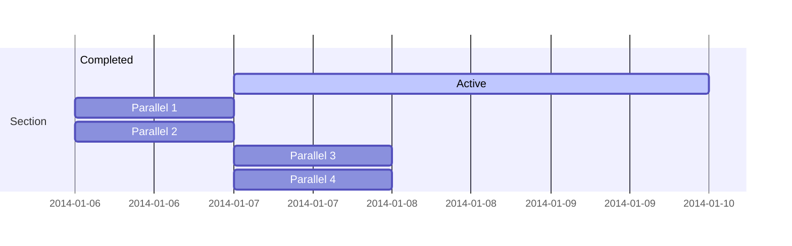

## 类图

> 文档参考：[Mermaid - Class Diagram](https://mermaid.js.org/syntax/classDiagram.html)

```markdown {lang=mermaid}
classDiagram
Class01 <|-- AveryLongClass : Cool
<< Interface >> Class01
Class09 --> C2 : Where am I?
Class09 --* C3
Class09 --|> Class07
Class07 : equals()
Class07 : Object[] elementData
Class01 : size()
Class01 : int chimp
Class01 : int gorilla
class Class10 {
  << service >>
  int id
  size()
}
```

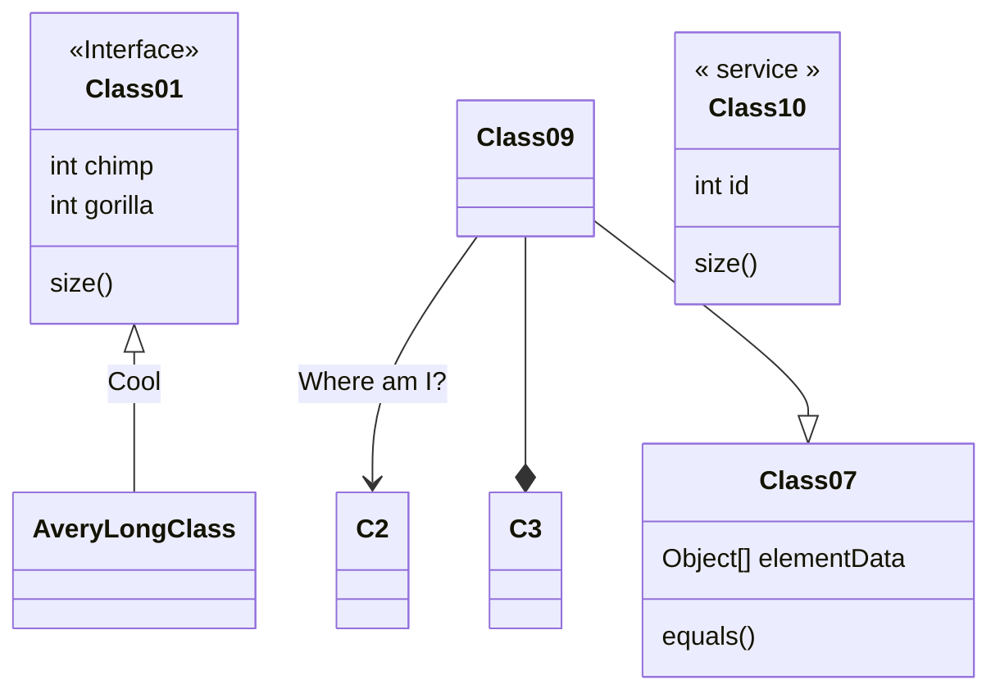

## ER 图

> 文档参考：[Mermaid - Entity Relationship Diagram](https://mermaid.js.org/syntax/entityRelationshipDiagram.html)

```markdown {lang=mermaid}
erDiagram
    CAR ||--o{ NAMED-DRIVER : allows
    CAR {
        string registrationNumber PK
        string make
        string model
        string[] parts
    }
    PERSON ||--o{ NAMED-DRIVER : is
    PERSON {
        string driversLicense PK "The license #"
        string(99) firstName "Only 99 characters are allowed"
        string lastName
        string phone UK
        int age
    }
    NAMED-DRIVER {
        string carRegistrationNumber PK, FK
        string driverLicence PK, FK
    }
    MANUFACTURER only one to zero or more CAR : makes
```

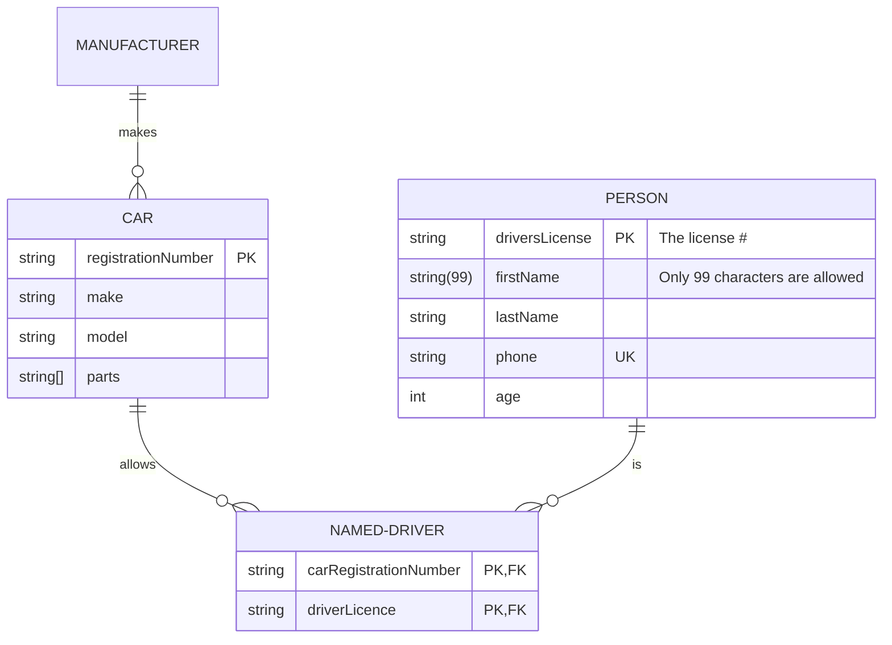

## 状态图

> 文档参考：[Mermaid - State Diagram](https://mermaid.js.org/syntax/stateDiagram.html)

```markdown {lang=mermaid}
stateDiagram-v2
[*] --> Still
Still --> [*]
Still --> Moving
Moving --> Still
Moving --> Crash
Crash --> [*]
```

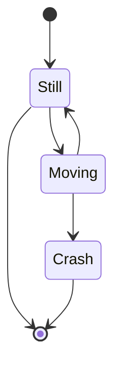

## 饼图

> 文档参考：[Mermaid - Pie Chart](https://mermaid.js.org/syntax/pie.html)

```markdown {lang=mermaid}
pie
"Dogs" : 386
"Cats" : 85
"Rats" : 15
```

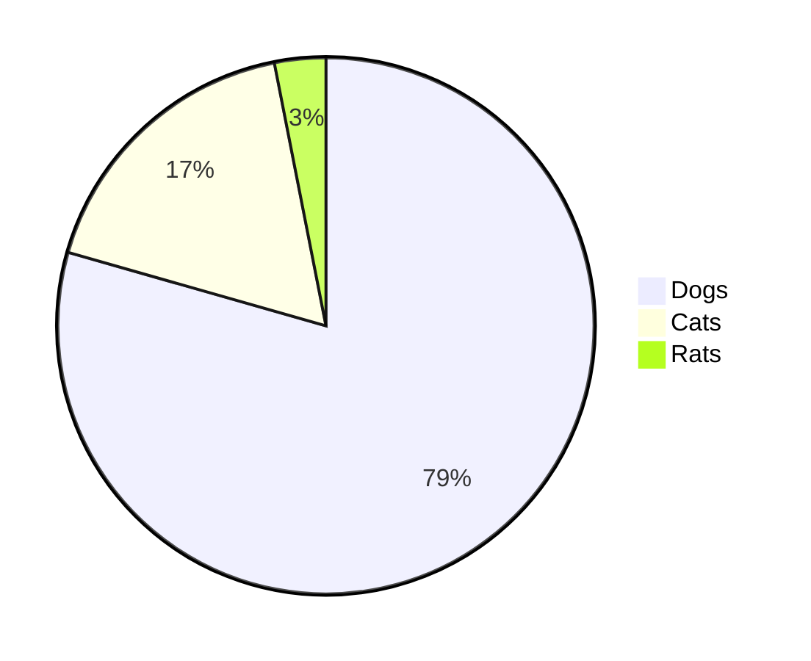

## 思维导图

> 文档参考：[Mermaid - Mindmaps](https://mermaid.js.org/syntax/mindmap.html)

```markdown {lang=mermaid}
mindmap
  root((mindmap))
    Origins
      Long history
      ::icon(fa fa-book)
      Popularisation
        British popular psychology author Tony Buzan
    Research
      On effectiveness<br/>and features
      On Automatic creation
        Uses
            Creative techniques
            Strategic planning
            Argument mapping
    Tools
      Pen and paper
      Mermaid
```

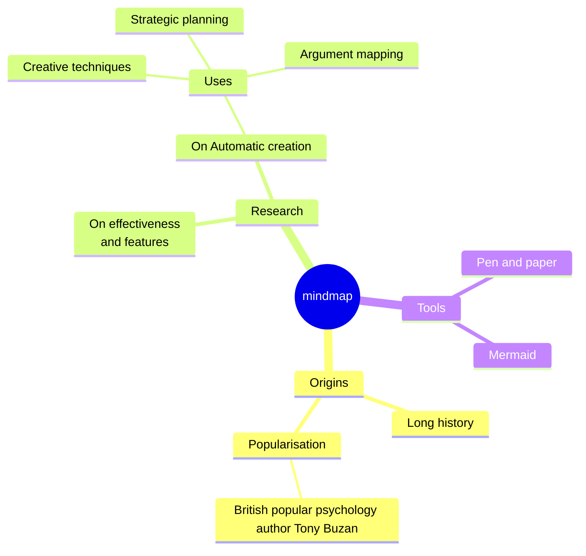


## 用户体验旅程图

> 文档参考：[Mermaid - User Journey](https://mermaid.js.org/syntax/userJourney.html)

```markdown {lang=mermaid}
journey
title My working day
section Go to work
  Make tea: 5: Me
  Go upstairs: 3: Me
  Do work: 1: Me, Cat
section Go home
  Go downstairs: 5: Me
  Sit down: 3: Me
```


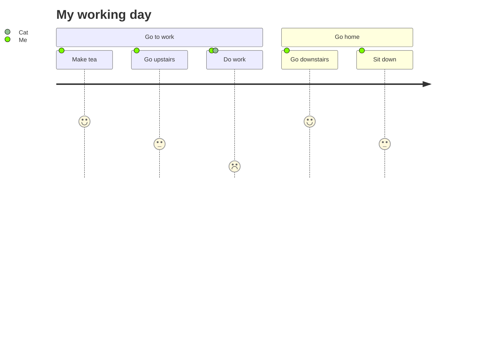

## C4 图⚠️

> ⚠️ Experimental.
>
> 文档参考：[Mermaid - C4 Diagram](https://mermaid.js.org/syntax/c4.html)

```markdown {lang=mermaid}
C4Context
title System Context diagram for Internet Banking System

Person(customerA, "Banking Customer A", "A customer of the bank, with personal bank accounts.")
Person(customerB, "Banking Customer B")
Person_Ext(customerC, "Banking Customer C")
System(SystemAA, "Internet Banking System", "Allows customers to view information about their bank accounts, and make payments.")

Person(customerD, "Banking Customer D", "A customer of the bank, <br/> with personal bank accounts.")

Enterprise_Boundary(b1, "BankBoundary") {

  SystemDb_Ext(SystemE, "Mainframe Banking System", "Stores all of the core banking information about customers, accounts, transactions, etc.")

  System_Boundary(b2, "BankBoundary2") {
    System(SystemA, "Banking System A")
    System(SystemB, "Banking System B", "A system of the bank, with personal bank accounts.")
  }

  System_Ext(SystemC, "E-mail system", "The internal Microsoft Exchange e-mail system.")
  SystemDb(SystemD, "Banking System D Database", "A system of the bank, with personal bank accounts.")

  Boundary(b3, "BankBoundary3", "boundary") {
    SystemQueue(SystemF, "Banking System F Queue", "A system of the bank, with personal bank accounts.")
    SystemQueue_Ext(SystemG, "Banking System G Queue", "A system of the bank, with personal bank accounts.")
  }
}

BiRel(customerA, SystemAA, "Uses")
BiRel(SystemAA, SystemE, "Uses")
Rel(SystemAA, SystemC, "Sends e-mails", "SMTP")
Rel(SystemC, customerA, "Sends e-mails to")
```

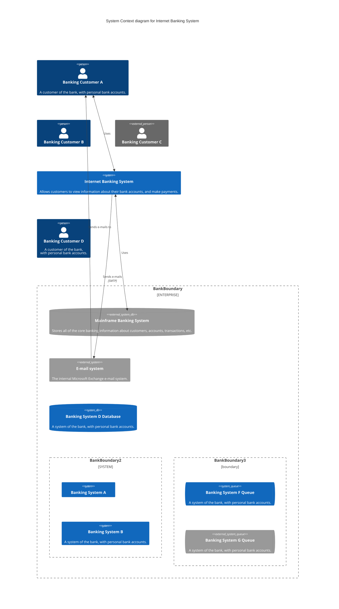

## 象限图

> 文档参考：[Mermaid - Quadrant Chart](https://mermaid.js.org/syntax/quadrantChart.html)

```markdown {lang=mermaid}
quadrantChart
    title Reach and engagement of campaigns
    x-axis Low Reach --> High Reach
    y-axis Low Engagement --> High Engagement
    quadrant-1 We should expand
    quadrant-2 Need to promote
    quadrant-3 Re-evaluate
    quadrant-4 May be improved
    Campaign A: [0.3, 0.6]
    Campaign B: [0.45, 0.23]
    Campaign C: [0.57, 0.69]
    Campaign D: [0.78, 0.34]
    Campaign E: [0.40, 0.34]
    Campaign F: [0.35, 0.78]
```

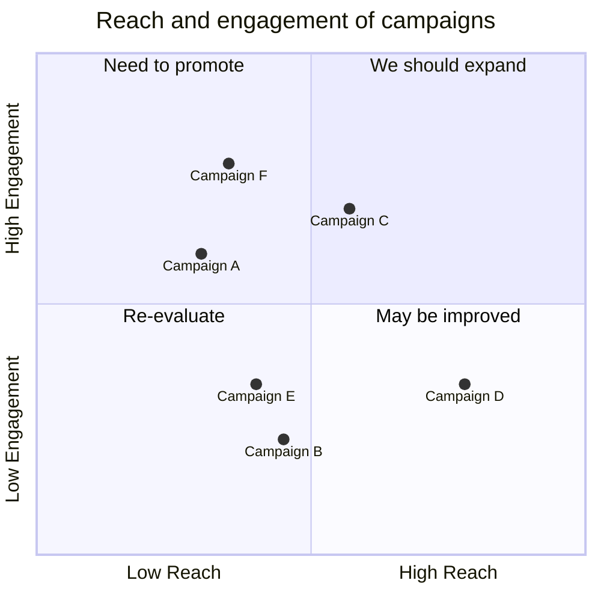

## 需求图

> 文档参考：[Mermaid - Requirement Diagram](https://mermaid.js.org/syntax/requirementDiagram.html)

```markdown {lang=mermaid fold=true}
requirementDiagram

requirement test_req {
id: 1
text: the test text.
risk: high
verifymethod: test
}

functionalRequirement test_req2 {
id: 1.1
text: the second test text.
risk: low
verifymethod: inspection
}

performanceRequirement test_req3 {
id: 1.2
text: the third test text.
risk: medium
verifymethod: demonstration
}

interfaceRequirement test_req4 {
id: 1.2.1
text: the fourth test text.
risk: medium
verifymethod: analysis
}

physicalRequirement test_req5 {
id: 1.2.2
text: the fifth test text.
risk: medium
verifymethod: analysis
}

designConstraint test_req6 {
id: 1.2.3
text: the sixth test text.
risk: medium
verifymethod: analysis
}

element test_entity {
type: simulation
}

element test_entity2 {
type: word doc
docRef: reqs/test_entity
}

element test_entity3 {
type: "test suite"
docRef: github.com/all_the_tests
}


test_entity - satisfies -> test_req2
test_req - traces -> test_req2
test_req - contains -> test_req3
test_req3 - contains -> test_req4
test_req4 - derives -> test_req5
test_req5 - refines -> test_req6
test_entity3 - verifies -> test_req5
test_req <- copies - test_entity2
```

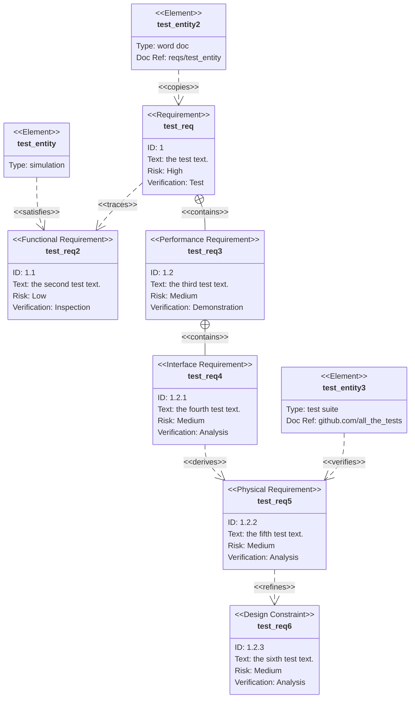

## Gitgraph 图

> 文档参考：[Mermaid - Gitgraph Diagrams](https://mermaid.js.org/syntax/gitgraph.html)

```markdown {lang=mermaid}
---
title: Example Git diagram
---
gitGraph
   commit
   commit
   branch develop
   checkout develop
   commit
   commit
   checkout main
   merge develop
   commit
   commit
```

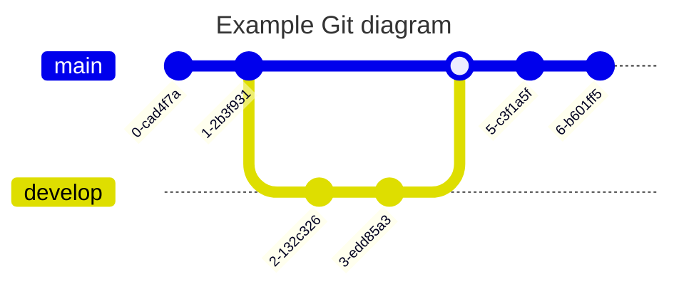

## 时间线图

> 文档参考：[Mermaid - Timeline](https://mermaid.js.org/syntax/timeline.html)

```markdown {lang=mermaid}
timeline
    title History of Social Media Platform
    2002 : LinkedIn
    2004 : Facebook
         : Google
    2005 : Youtube
    2006 : Twitter
```

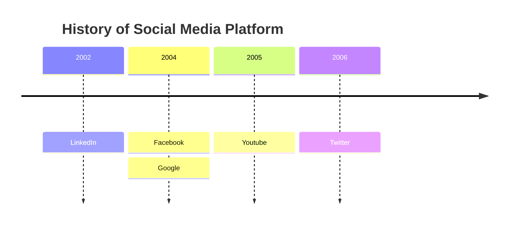

## XY 图表

> 文档参考：[Mermaid - XYChart](https://mermaid.js.org/syntax/xyChart.html)

```markdown {lang=mermaid}
xychart-beta
    title "Sales Revenue"
    x-axis [jan, feb, mar, apr, may, jun, jul, aug, sep, oct, nov, dec]
    y-axis "Revenue (in $)" 4000 --> 11000
    bar [5000, 6000, 7500, 8200, 9500, 10500, 11000, 10200, 9200, 8500, 7000, 6000]
    line [5000, 6000, 7500, 8200, 9500, 10500, 11000, 10200, 9200, 8500, 7000, 6000]
```

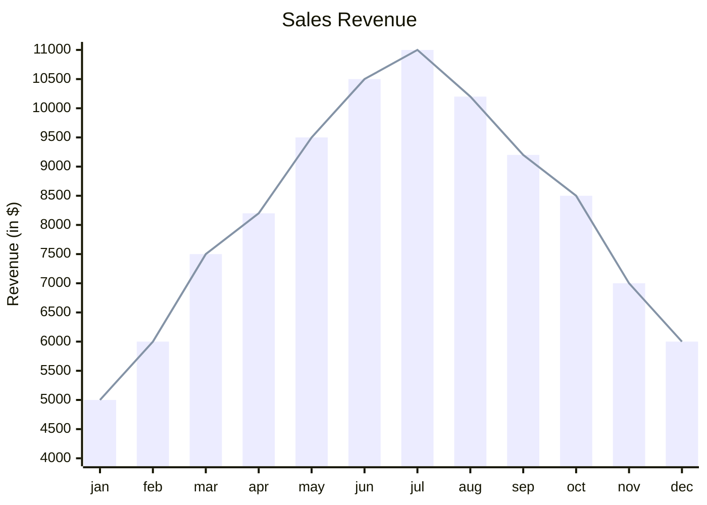

## 框图文档

> 文档参考：[Mermaid - Block Diagram](https://mermaid.js.org/syntax/block.html)

```markdown {lang=mermaid}
block-beta
columns 1
  db(("DB"))
  blockArrowId6<["&nbsp;&nbsp;&nbsp;"]>(down)
  block:ID
    A
    B["A wide one in the middle"]
    C
  end
  space
  D
  ID --> D
  C --> D
  style B fill:#969,stroke:#333,stroke-width:4px
```

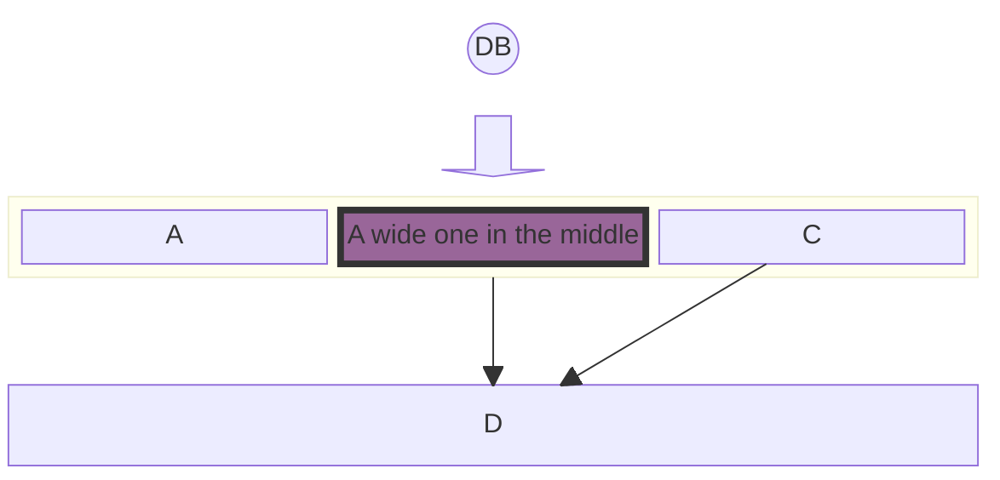

## 桑基图

> 文档参考：[Mermaid - Sankey](https://mermaid.js.org/syntax/sankey.html)

```markdown {lang=mermaid fold=true}
---
config:
  sankey:
    showValues: false
---
sankey-beta

Agricultural 'waste',Bio-conversion,124.729
Bio-conversion,Liquid,0.597
Bio-conversion,Losses,26.862
Bio-conversion,Solid,280.322
Bio-conversion,Gas,81.144
Biofuel imports,Liquid,35
Biomass imports,Solid,35
Coal imports,Coal,11.606
Coal reserves,Coal,63.965
Coal,Solid,75.571
District heating,Industry,10.639
District heating,Heating and cooling - commercial,22.505
District heating,Heating and cooling - homes,46.184
Electricity grid,Over generation / exports,104.453
Electricity grid,Heating and cooling - homes,113.726
Electricity grid,H2 conversion,27.14
Electricity grid,Industry,342.165
Electricity grid,Road transport,37.797
Electricity grid,Agriculture,4.412
Electricity grid,Heating and cooling - commercial,40.858
Electricity grid,Losses,56.691
Electricity grid,Rail transport,7.863
Electricity grid,Lighting & appliances - commercial,90.008
Electricity grid,Lighting & appliances - homes,93.494
Gas imports,Ngas,40.719
Gas reserves,Ngas,82.233
Gas,Heating and cooling - commercial,0.129
Gas,Losses,1.401
Gas,Thermal generation,151.891
Gas,Agriculture,2.096
Gas,Industry,48.58
Geothermal,Electricity grid,7.013
H2 conversion,H2,20.897
H2 conversion,Losses,6.242
H2,Road transport,20.897
Hydro,Electricity grid,6.995
Liquid,Industry,121.066
Liquid,International shipping,128.69
Liquid,Road transport,135.835
Liquid,Domestic aviation,14.458
Liquid,International aviation,206.267
Liquid,Agriculture,3.64
Liquid,National navigation,33.218
Liquid,Rail transport,4.413
Marine algae,Bio-conversion,4.375
Ngas,Gas,122.952
Nuclear,Thermal generation,839.978
Oil imports,Oil,504.287
Oil reserves,Oil,107.703
Oil,Liquid,611.99
Other waste,Solid,56.587
Other waste,Bio-conversion,77.81
Pumped heat,Heating and cooling - homes,193.026
Pumped heat,Heating and cooling - commercial,70.672
Solar PV,Electricity grid,59.901
Solar Thermal,Heating and cooling - homes,19.263
Solar,Solar Thermal,19.263
Solar,Solar PV,59.901
Solid,Agriculture,0.882
Solid,Thermal generation,400.12
Solid,Industry,46.477
Thermal generation,Electricity grid,525.531
Thermal generation,Losses,787.129
Thermal generation,District heating,79.329
Tidal,Electricity grid,9.452
UK land based bioenergy,Bio-conversion,182.01
Wave,Electricity grid,19.013
Wind,Electricity grid,289.366
```

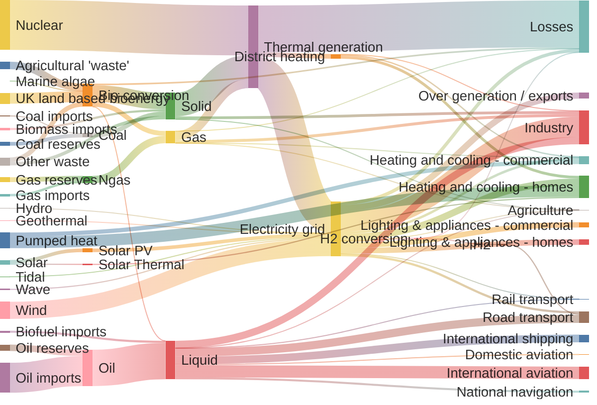

